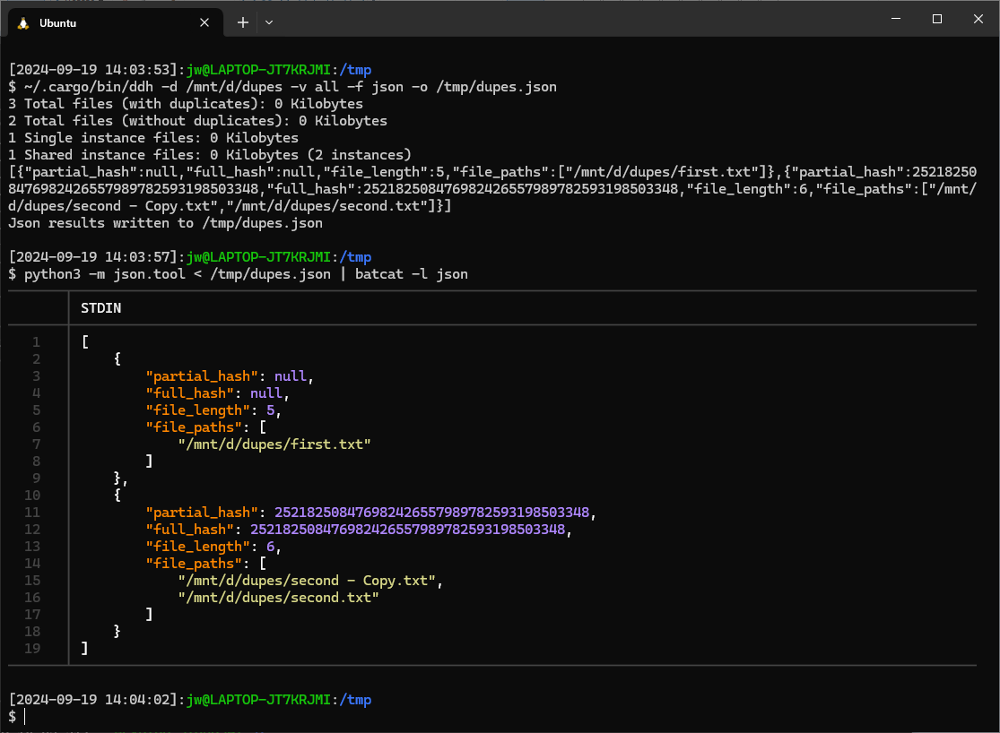

# ddhdedup
Use the DDH Command Line Tool to Remove Duplicate Files

## Introduction

This clog explains how you can use the command line to remove duplicate files, which are files that contain the same content as other files. I used the the `ddh` command line tool written in the Rust programming language with the bash shell under Windows Subsystem for Linux (WSL). 

This approach is potenitlaly fast in that it uses the command line, Rust, and apparently something like file checksums rather than bitwise comparison, and flexible in that the `ddh` command line tool supports command line options (or even use as a Rust library) as well as the ability to edit the generated JSON, and provides a sort of audit trail by using a JSON file and a script.

## DDH

DDH (Directory Differential hTool) is a library and Command Line Interface (CLI) written in Rust to locate duplicate files.

- [https://github.com/darakian/ddh]

In WSL, I think you do something like the following to install rust tooling including cargo, which manages Rust packages.

```sh
sudo snap install rustup --classic
sudo apt install cargo
rustup update
```

Then you can use `cargo` to install the `ddh` command line tool:

```sh
cargo install --git https://github.com/darakian/ddh ddh
```

## Use Case

I mount the Windows `D:\` drive as `/mnt/d`:

```sh
sudo mkdir /mnt/d
sudo mount -t drvfs d: /mnt/d
```

I use the `ddh` command line tool to generate a JSON (`-f`) file (`-o`) that lists all (`-v`) of the files under the `D:\dupes` (`-d`) subdirectory:

```sh
~/.cargo/bin/ddh -d /mnt/d/dupes -v all -f json -o /tmp/dupes.json
```

I use `python3` to pretty-print the JSON and `batcat` to format the result:

```sh 
python3 -m json.tool < /tmp/dupes.json | batcat -l json
```



Duplicates appear as follows:

```json
"file_paths": [
  "/mnt/d/dupes/second - Copy.txt",
  "/mnt/d/dupes/second.txt"
]
```

All and only such lines that indicate a duplicated file contain only a single quoted value and end with a comma. I use `grep` to pass lines that contain that pattern through `sed` to replace the leading whitespace with the `rm ` command and then to remove the trailing comma, writing the result to a script file that I will run to remove the duplicate files.

```sh
python3 -m json.tool < /tmp/dupes.json | grep '\"/mnt/d/dupes/.*\"\,' | sed -e 's/^\W*/rm "\//' | sed -e 's/,$//' > /tmp/remdupes.sh
```

I check the script:

```
batcat -l sh /tmp/remdupes.sh
```

I run the script:

```sh
sh /tmp/remdupes.sh
```

I unmount the Windows `D:` drive and remove artifacts:

```sh
sudo umount /mnt/d
sudo rmdir /mnt/d
rm /tmp/dupes.json
rm /tmp/remdupes.sh
```

## Caveats

This relies on the `ddh` command line tool including its file checksum logic.

This leaves the last instance of the file as listed in the JSON file created by the `ddh` command line tool.

It would likely be more efficient to remove all of the files at once, or in large batches, rather than individually.

This doesn't remove empty directories.
